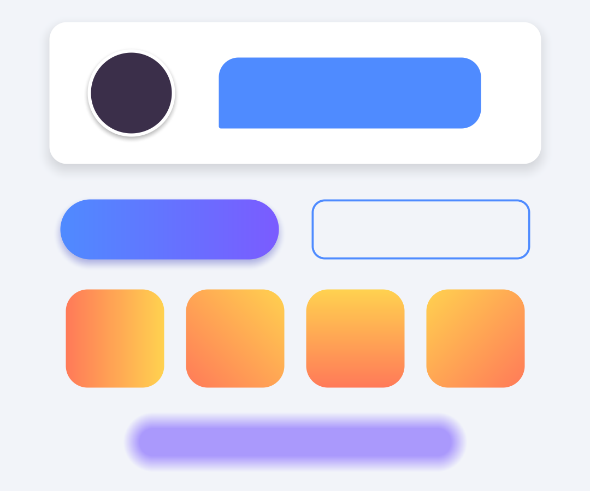

# ShapeKit — Sprite-free UI Shapes for uGUI

Rounded rectangles, pills and circles for Unity UI **without sprites or 9-slicing**.
One component, one shared material, one draw call.



## Why ShapeKit

| | |
| --- | --- |
| **Batches everything** | Every parameter lives in vertex data, so shapes with different radii, colors, outlines and shadows still batch into a single draw call. |
| **All-in-one** | Per-corner radius, pill/circle mode, outline, linear gradient, drop shadow, edge softness and circular sprite crop on a single `ShapeImage`. |
| **Shape-accurate touch** | Clicks on the transparent rounded corners pass through, so tightly packed round buttons don't steal each other's taps. |
| **Crisp at any size** | Edges are computed per pixel, so shapes stay sharp from 0.5x to 4x canvas scale with no texture memory. |
| **Mobile ready** | `SafeAreaFitter` for notches and `ShapePressFeedback` for tactile buttons are included. |
| **Plays well with others** | Works inside `Mask`, `RectMask2D`, `CanvasGroup`, Button color transitions, and alongside UIEffect. |

## Requirements

- Unity 2021.3 or later, uGUI
- Built-in, URP and HDRP (screen space overlay / camera canvases)

## Installation

Copy the `ShapeKit` folder into your project's `Packages/` folder (embedded package), or add it with
**Package Manager → + → Add package from disk…** and select `package.json`.

## Quick start

1. **GameObject → UI → ShapeKit → Shape Image** (or **Pill Button**).
2. Click a preset at the top of the inspector: **Card**, **Pill**, **Outline**, **Avatar**, **Glow**.
3. Tweak Shape, Fill, Outline and Shadow sections.

To see everything at once, import the **Demo** sample from the Package Manager, add `ShapeKitDemo` to an
empty GameObject in an empty scene and press Play.

## Components

### ShapeImage

| Section | Properties |
| --- | --- |
| Shape | `cornerMode` (Uniform / PerCorner / Pill), `radius`, `cornerRadii` (TL, TR, BR, BL), `edgeSoftness` |
| Fill | `color` (tint), `sprite` (optional, cropped to the shape), `fillMode` (Solid / LinearGradient), `gradientStart`, `gradientEnd`, `gradientAngle` |
| Outline | `outlineWidth`, `outlineColor` — set `color` alpha to 0 for a hollow shape |
| Shadow | `shadowEnabled`, `shadowColor`, `shadowOffset`, `shadowBlur`, `shadowSpread` |
| Input | `preciseRaycast` |

Everything is scriptable:

```csharp
var shape = gameObject.AddComponent<ShapeImage>();
shape.cornerMode = ShapeImage.CornerMode.Pill;
shape.fillMode = ShapeImage.FillMode.LinearGradient;
shape.gradientStart = new Color32(0x4F, 0x8B, 0xFF, 0xFF);
shape.gradientEnd = new Color32(0x7B, 0x5C, 0xFF, 0xFF);
shape.shadowEnabled = true;
```

### SafeAreaFitter

Fits its RectTransform to `Screen.safeArea`. Put it on a full-screen child of the canvas and parent your UI to it.
Each edge can be toggled, e.g. keep a bottom bar flush with the screen edge while the top avoids the notch.

### ShapePressFeedback

Scales the object down and tightens the `ShapeImage` shadow while pressed, giving buttons a physical "push" feel.
Respects `Selectable.interactable` and can run on unscaled time for pause menus.

## How it works

`ShapeImage` writes the shape description (size, radii, outline, colors) into extra vertex channels
(`TEXCOORD1-3`, `NORMAL`, `TANGENT`) that it enables on the canvas automatically. The shader evaluates a signed
distance function per pixel, so a single material can draw any combination of shapes. Shadows are a second quad in
the same mesh. Because nothing is stored in material properties, the canvas batcher can merge all ShapeImages that
share a texture.

## Limitations

- Shapes using different sprites cannot batch together (same rule as `Image`).
- `RectMask2D` softness is not applied (hard clipping is).
- The canvas must keep the additional shader channels ShapeKit enables; don't strip them in custom canvas code.
